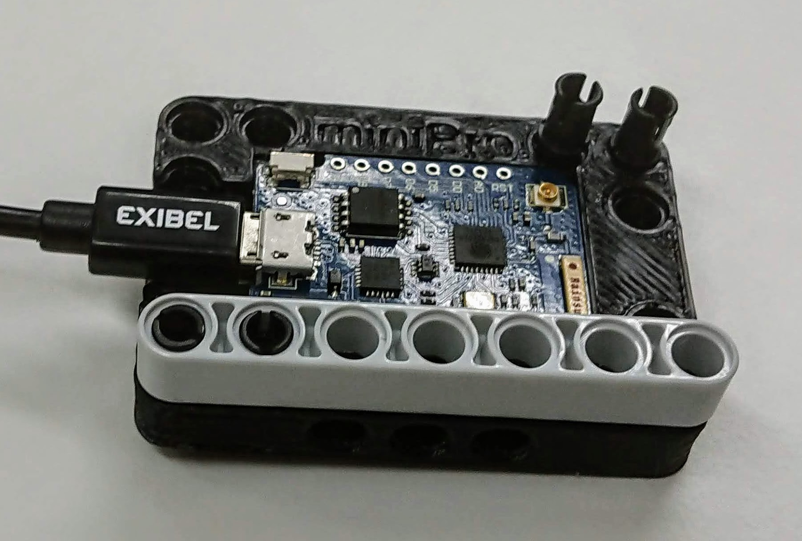
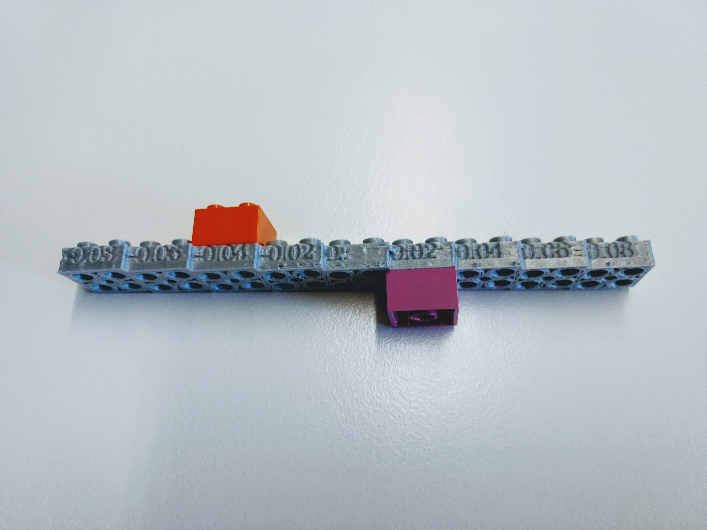
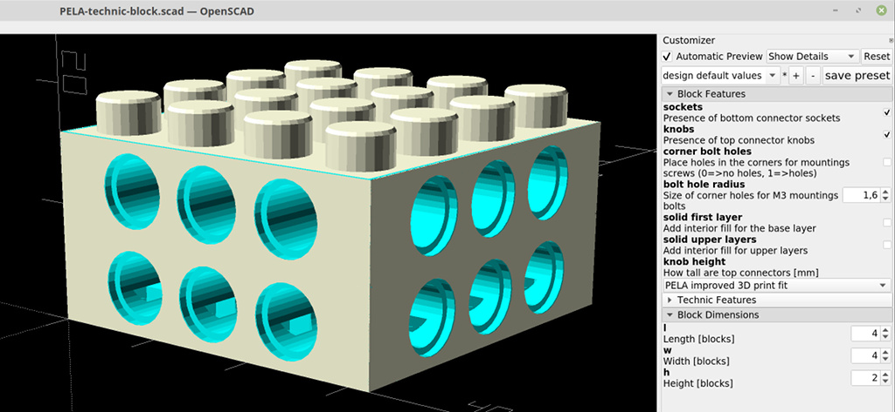
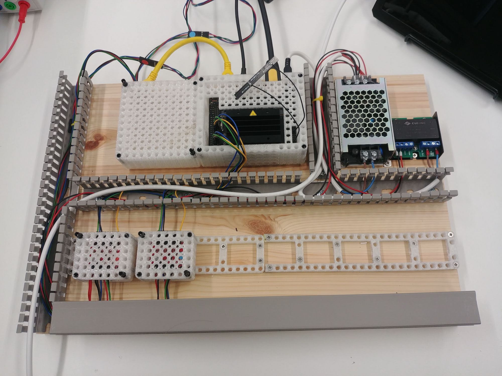

The fastest way to get support on designing and 3D printing your custom part is on [Discord PELA Blocks](https://discord.gg/Yy2srz)

# PELA Blocks

We measured the length, width and thickness of this board. Moving sliders in the customizer graphical interface of the  `PELA Technic Mount` created this functional prototype enclosure with nicely calibrated snap fit connectors. Now we can rapidly iterate our models in the field. 5 minutes plus 30 minutes for printing. This model is saved as a drop down preset of the `PELA Technic Mount` model.

Now you can design models without coding and snap them together!

## LEGO-compatible Parametric 3D Printed Blocks

PELA blocks are designed for easy 3D printing, strength, and rapid customization using free software. One time calibration gives perfect snap-together objects in exotic materials and geometries to help you explore your ideas and build with exotic materials and any motors and electronics you like. Example enclosures with many options for custom sensors, actuators, computers and IoT devices are included, or create your own.

These designs are not by the LEGO corporation. LEGO-compatible blocks are available from multiple manufacturers. Associated basic block patents expired long ago. Press-fit blocks existed before LEGO and we continue that tradition of adapt, evolve and improve as we provide these open source designs for 3D printing.

The name PELA comes from the Finnish "pelataan" meaning "let's play". This [blog post](https://medium.com/@futurice/rapid-hardware-prototyping-turbocharge-your-process-with-pela-blocks-58d0fcff63c5) on how we use these to build a self-driving 1:10 drift car is a good example of rapid prototyping "play".

## Download

**The STL files shown are not calibrated for your printer.** To get a good snap fit with your 3D printer and different material, you need to fine tune the size of knobs, sockets and technic holes. Some starting values are 

1. **[DOWNLOAD](https://github.com/LEGO-compatible-gadgets/PELA-blocks/archive/master.zip)** the latest designs, or `git clone git@github.com:LEGO-Prototypes/PELA-blocks.git --recurse-submodules`, then `git lfs install` in each git module
1. **[Calibrate](#calibrate)** the PELA Block models for your material and printer

See [Advanced Setup](ADVANCED-SETUP.md) for additional tricks.

See the [Slicer Recommendations](SLICER.md) for information about different printing materials we have tested.

## Calibrate

**TL;DR** *: To get a nice snap fit for your printer, slicer settings and material, print a calibration beam and test fit commercial bricks to the top knobs, bottom sockets and side technic holes. Update the best `top_tweak` and `bottom_tweak` into [`material.scad`](material.scad). Now open any model in OpenSCAD, press `F6` to generate the model then `F7` to export an STL.*

There are several possible calibration beams. Most users will want the one linked below unless they are printing with flexible filament.

Test fit the top, bottom and sides to get something which is tight but not too tight. Then update your settings in  [`material.scad`](https://github.com/PELA-Prototypes/parametric-PELA/blob/master/material.scad) then one time calibration is complete.

## OpenSCAD Settings

The software needed is also free and open source, [OpenSCAD](https://www.openscad.org/). After install, `Edit | Preferences | Features | Customizer | Enable`. Also for large models and a fast machine, `Edit | Preferences | Advanced | Turn off rendering at _1000000_` and disable `OpenGL 1.0` compatability. 

You can also configure slicing and printing directly from OpenSCAD. See their website for details.

___

[PELA Calibration Beam, Normal Filament](https://github.com/LEGO-compatible-gadgets/PELA-blocks/blob/master/PELA-calibration.stl) PELA Calibration Beam for standard filament (non-flexible).

### Calibration Instructions

Your printer, slicer settings, and plastic effect the precise fit. To correct for this, we adjust the models slightly for your printing process. Calibration is a one time process for each material. It is as simple as fitting two blocks together and editing a text file, [`material.scad`](material.scad) to indicate which test block fits best.

Before you print the calibration beam, be sure to set the `flexible_material` and `large_nozzle` settings in [`material.scad`](https://github.com/PELA-Prototypes/parametric-PELA/blob/master/material.scad).

After you print the clibration beam, you update three settings to get a tight fit: `top_tweak`, `bottom_tweak` and `axle_hole_tweak`. These can be read from the side of the calibration beam.

1. Print the Calibration Beam and test fit the top knobs and bottom sockets against commercial LEGO. Put the `top_tweak` (on the side, near the top) and `bottom_tweak` (on the side, near the bottom) values that you can read from the side of the beam into `material.scad`.
1. Use OpenSCAD to generate a new 2x2x1 `PELA Block` in OpenSCAD using these new settings, press `F6` to render, and `Export` as `.STL`.
1. Confirm a good fit with both commercial blocks and other PELA Blocks.
1. If you find you also need to adjust the technic connector hole size, print the Calibration Block Set. `axle_hole_tweak` numbers change along with `top_tweak` numbers.
1. Repeat this process as needed when you change material, nozzle size or and slicer settings which affect geometry.

## Advanced Calibration

An alternative set of individual calibration blocks are available, and if you have an unusual material there are other numbers you can tune such as various part thicknesses. See [Advanced Calibration](ADVANCED-CALIBRATION)

## PELA-compatible Part Designs

Edit `material.scad` and `style.scad` to adapt these models before printing them. **The example models below are not yet calibrated for your slicer and printer. Calibrate and then make the tuned model from the .scad file.**

[PELA Block](https://github.com/LEGO-compatible-gadgets/PELA-blocks/blob/master/PELA-block.stl)

___

[PELA Technic Block](https://github.com/LEGO-compatible-gadgets/PELA-blocks/blob/master/PELA-technic-block.stl) A blending of traditional and technic features which extends the basic block. All other models are extensions and variants of this.

___

[PELA Technic Beam](https://github.com/LEGO-compatible-gadgets/PELA-blocks/blob/master/technic-beam/PELA-technic-beam.stl) A minimalist technic beam.

___

[PELA Technic Twist Beam](https://github.com/LEGO-compatible-gadgets/PELA-blocks/blob/master/technic-beam/PELA-technic-twist-beam.stl) A technic beam with a center section of holes rotated 90 degrees.

___

[PELA Technic Corner](https://github.com/LEGO-compatible-gadgets/PELA-blocks/blob/master/technic-beam/PELA-technic-corner.stl) Two beams joined at an angle co-axial to the technic holes.

___

[PELA Technic Bent Beam](https://github.com/LEGO-compatible-gadgets/PELA-blocks/blob/master/technic-beam/PELA-technic-bent-beam.stl) Two beams joined at an angle normal to the technic holes.

___

[PELA Technic Angle Connector](https://github.com/LEGO-compatible-gadgets/PELA-blocks/blob/master/technic-beam/PELA-technic-angle-connector.stl) Two beams joined lengthwise at an angle.

___

[PELA Technic Axle](https://github.com/LEGO-compatible-gadgets/PELA-blocks/blob/master/axle/PELA-technic-axle.stl) Rigid and flexible material shafts of adjustable length for attaching to other 3D printed designs such as wheels which you want to rotate freely.

___

[PELA Technic Cross Axle](https://github.com/LEGO-compatible-gadgets/PELA-blocks/blob/master/axle/PELA-technic-cross-axle.stl) Rigid and flexible material torque drive shafts for adjustable length for attaching to other 3D printed designs.

___

[PELA Technic Wheel](https://github.com/LEGO-compatible-gadgets/PELA-blocks/blob/master/axle/PELA-technic-wheel.stl) A spoked wheel that connects to a cross axle hub. Consider using flexible materials and tuning the wheel hardness as a simple shock absorber.

___

[PELA Socket Panel](https://github.com/LEGO-compatible-gadgets/PELA-blocks/blob/master/PELA-socket-panel.stl) Insert knobs from both the top and bottom. Zoom in to see the subtle flexure ridges for enhanced "snap" fit.

___

[PELA Knob Panel](https://github.com/LEGO-compatible-gadgets/PELA-blocks/blob/master/PELA-knob-panel.stl) Optional corner holes for M3 bolts can be enabled

___

[PELA Simplified Technic Peg](https://github.com/LEGO-compatible-gadgets/PELA-blocks/blob/master/peg/PELA-simplified-technic-peg.stl) An easier-to-print version of a technic peg. This works best with a smaller nozzle and slightly flexible materials.

___

[PELA Simplified Technic Peg for Flex Materials](https://github.com/LEGO-compatible-gadgets/PELA-blocks/blob/master/peg/PELA-simplified-technic-peg-flexmaterial.stl) An easier-to-print version of a technic peg for TPU95, TPU85/Ninjaflex and similar flexible materials.

___

[PELA Technic Peg](https://github.com/LEGO-compatible-gadgets/PELA-blocks/blob/master/peg/PELA-technic-peg.stl) This is difficult to print with some material, but useful you run short and don't want to wait for mail order. It works best with slightly flexible materials.

___

[PELA Technic Peg Array](https://github.com/LEGO-compatible-gadgets/PELA-blocks/blob/master/peg/PELA-technic-peg-array.stl) A set of technic pegs.

___

[PELA Technic Rail](https://github.com/LEGO-compatible-gadgets/PELA-blocks/blob/master/technic-beam/PELA-technic-rail.stl) A variable length ladder-like mounting rail to bolt to a project board for clean, flexible layouts.

___

[PELA Raspberry Pi 4 Technic Mount](https://github.com/LEGO-compatible-gadgets/PELA-blocks/blob/master/technic-mount/PELA-raspberry-pi4-technic-mount.stl) A Raspberry Pi 2/3B+/4 enclosure.

___

[PELA Raspberry Pi Zero W Technic Mount](https://github.com/LEGO-compatible-gadgets/PELA-blocks/blob/master/technic-mount/PELA-raspberry-pi-zero-w-technic-mount.stl) A Raspberry Pi Zero W holder.

___

[PELA Raspberry Pi Camera Technic Mount](https://github.com/LEGO-compatible-gadgets/PELA-blocks/blob/master/technic-mount/PELA-raspberry-pi-camera-technic-mount.stl) A Raspberry Pi camera holder.

___

[PELA Jetson Nano Technic Mount](https://github.com/LEGO-compatible-gadgets/PELA-blocks/blob/master/technic-mount/PELA-jetson-nano-technic-mount.stl) An NVIDEA Jetson Nano enclousure.

___

[PELA Jetson Nano Battle Cap](https://github.com/LEGO-compatible-gadgets/PELA-blocks/blob/master/technic-mount/PELA-jetson-nano-battle-cap.stl) An NVIDEA Jetson Nano intrusion cover. This is useful to protect robots and self-driving cars from cooling fan impact damage which could break the PCB.

___

[PELA Intel T265 Realsense Tracking Camera Technic Mount](https://github.com/LEGO-compatible-gadgets/PELA-blocks/blob/master/technic-mount/PELA-t265-realsense-tracking-camera-technic-mount.stl) An enclosure for an [Intel T265](https://www.intelrealsense.com/tracking-camera-t265/) AI SLAM camera.

___

[PELA STMF4 Discovery Technic Mount](https://github.com/LEGO-compatible-gadgets/PELA-blocks/blob/master/technic-mount/PELA-stmf4-discovery-technic-mount.stl) Enclosure for the [STMF4 Discovery](https://www.st.com/en/evaluation-tools/stm32f4discovery.html) board.

___

[PELA Powerbank Technic Mount](https://github.com/LEGO-compatible-gadgets/PELA-blocks/blob/master/technic-mount/PELA-powerbank-technic-mount.stl) A container for a Clas Ohlson 38-3456 USB battery.

___

[PELA Sparkfun BigEasyDriver Technic Mount](https://github.com/LEGO-compatible-gadgets/PELA-blocks/blob/master/technic-mount/PELA-sparkfun-bigeasydriver-technic-mount.stl) A pulsed infra-red motion sensor holder.

___

[PELA PIR Motion Sensor Technic Mount](https://github.com/LEGO-compatible-gadgets/PELA-blocks/blob/master/technic-mount/PELA-pir-technic-mount.stl) A pulsed infra-red motion sensor holder.

___

[PELA Technic NodeMCU v2 Mount](https://github.com/LEGO-compatible-gadgets/PELA-blocks/blob/master/technic-mount/PELA-nodemcu-v2-technic-mount.stl) A technic mount for NodeMCU v2.

___

[PELA Arduino Uno Technic Mount](https://github.com/LEGO-compatible-gadgets/PELA-blocks/blob/master/technic-mount/PELA-arduino-uno-technic-mount.stl) For holding an Arduino Uno microcontroller board within a PELA block

___

[PELA Technic Seeed Respeaker Core v2 Mount](https://github.com/LEGO-compatible-gadgets/PELA-blocks/blob/master/technic-mount/PELA-respeaker-core-v2-mount.stl) A technic mount for the Respeaker Core v2 microphone array.

___

[PELA Vertical Sign](https://github.com/LEGO-compatible-gadgets/PELA-blocks/blob/master/sign/PELA-vertical-sign.stl) Change the text to label your designs. Options include front and back text with either etched for raised text.

___

[PELA Panel Sign](https://github.com/LEGO-compatible-gadgets/PELA-blocks/blob/master/sign/PELA-panel-sign.stl) Change the text to label your design either etched for raised text.

___

[PELA Technic Sign](https://github.com/LEGO-compatible-gadgets/PELA-blocks/blob/master/sign/PELA-technic-sign.stl) Change the text to label your design.

___

[PELA Box Enclosure](https://github.com/LEGO-compatible-gadgets/PELA-blocks/blob/master/PELA-box-enclosure.stl) A generic enclosure for mounting boards inside protective side walls.

___

[PELA Round Motor Enclosure](https://github.com/LEGO-compatible-gadgets/PELA-blocks/blob/master/motor/PELA-round-motor-enclosure.stl) Add a round round motor holder for 1:10 electric cars

___

[PELA N20 Gearmotor Enclosure](https://github.com/LEGO-compatible-gadgets/PELA-blocks/blob/master/motor/PELA-n20-gearmotor-enclosure.stl) Add a commonly available small gear motor to your design. Adjust the model parameters to fit other motor sizes.

___

[PELA HTC Vive Tracker Mount](https://github.com/LEGO-compatible-gadgets/PELA-blocks/blob/master/vive-tracker/PELA-vive-tracker-mount.stl) [HTC Vive Tracker](https://www.vive.com/) attachment to your designs becomes easy to remove.

___

[PELA Camera Mount Screw](https://github.com/LEGO-compatible-gadgets/PELA-blocks/blob/master/vive-tracker/PELA-camera-mount-screw.stl) You can use this quarter inch standard camera mount screw for flush mounting the HTC Vive to the Vive Tracker Mount. The printed version works better than you might expect.

___

[PELA Strap Mount](https://github.com/LEGO-compatible-gadgets/PELA-blocks/blob/master/PELA-strap-mount.stl) For attaching using strap or similar straps through the bottom slot. For example use this with velcro straps to mount Vive trackers on your shoes..

___

[PELA PCA9685 16 Channel Servo Board Technic Mount](https://github.com/LEGO-compatible-gadgets/PELA-blocks/blob/master/technic-mount/PELA-pca9685-servo-board-technic-mount.stl) For holding a servo board within a PELA block with connectors exposed at one end. We use these with 1:10 RC drift cars and Rasperry Pi for a [PELA drift car](https://driftcar.pelablocks.org/) in the [Markku Invitational](https://markku.ai/) contest based on [Donkeycar](https://www.donkeycar.com/).

## FFF Printing Tips
§
* Use a 0.4mm or smaller nozzle if possible to avoid decimation of some socket details
* If slicing with Simplify 3D with 0.5mm or larger nozzle, you may want to set Simplify 3D to `Advanced | External Thing Wall Type | Allow single extrusion walls`
* Be aware that slicers may in some cases not be able to correct OpenSCAD STL export errors. These errors should be visible in layer preview as for example extra excursions back to origin. If this happens, open and clean the STL files first with for example Microsoft 3D Builder, Meshmixer or MeshLab. MeshLab command line examples can be found in `build.ps1`.
* Best results are achieved with durable materials that are not too stiff (PET, co-polymers like NGEN, semi-flexible and "engineering" materials instead of PLA and  carbon filled).
* Best results are achieved with smaller nozzle diameters. Adjust slicer settings for precision over speed. Layer height is not particularly important on most models.
* Think carefully before using very slippery materials such as Nylon.
* "standard" and "fast" print setting layer lines are helpful for extra connector grip provided the resulting print geometry is sufficiently accurate.
* A print "brim" the appears inside the model may negatively affect the bottom connector fit
* Leaving the blocks on a heated bed may negatively affect the bottom connector fit

## Resin Printing Tips

* If more than 2 layer tall PELA with a relatively solid interior not allowing drainage below the knobs, check if you need to expand the airhole to allow resin to drain from the flexure chamber inside each knob
* For translucent materials, setting knob_slice_count to 0 may make the interior structure look more like a standard PELA at the cost of a slight reduction of knob sidewall flex

## License

These designs are by PELA project contributors, not by the LEGO corporation. They are compatible with LEGO and similar blocks available from multiple manufacturers and online projects. The associated patents have expired. These designs are not identical to LEGO; they have been specially modified for easy 3D printing and offered in the spirit of open source collaborative innovation.

If what you want is available as injection molded plastic, buy it for the higher quality and durability. These model are helpful when you want something customized, a special color, an unusual material, and for replacement parts when you just can't wait.

These open source designs are brought to you by [Futurice](https://futurice.com) and contributions from the community. Come work with the best.

## Projects Using PELA Blocks

PELA has been used to create a self-driving car: 

 and enclosures are a great way to make bigger IOT projects without the duct tape: 

PELA is also used to create robot parts: 

The generated 3D models displayed here are hosted in a separate GitHub project to minimize the size of pulling changes in this repo: [PELA-blocks](https://github.com/LEGO-compatible-gadgets/PELA-blocks)

## Alternative 3D Block Designs

If you don't find what you need, consider adding it, contact us or check out the many other excellent design available.

[marian42's excellent online technic part generator](https://marian42.de/partdesigner/) can help you make custom connectors and fixture easily. 

[Yeggi search for LEGO](https://www.yeggi.com/q/lego/)

[Thingiverse Parametric LEGO Group](https://www.thingiverse.com/groups/parametric-lego) is an alternate source for these block designs. These designs don't work with the online customizer (speed and complexity, multiple files), so the best path is still to install the newest [OpenSCAD](https://www.openscad.org/) and **[download](https://github.com/LEGO-compatible-gadgets/PELA-blocks/archive/master.zip)** the models.

## Contact

New models, collaboration and pull requests are welcome. You have the tools- now create something cool and share with the world : https://github.com/LEGO-compatible-gadgets/PELA-blocks

paul.houghton@futurice.com ( **[Blog](https://medium.com/@paulhoughton)** - **[Twitter](https://twitter.com/mobile_rat)**)

If you like what you see, please tweet and let others know!

