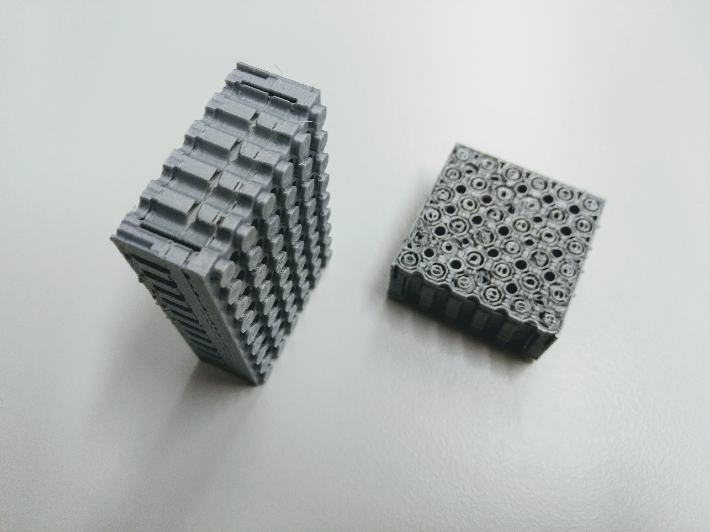

# PELA Blocks
## Slicer Recommmendations

Our experience with different materials are recommended below. Unless otherwise noted, prints are on a Lulzbot Taz 6, 0.5mm extruder, using LulzBot Cura.

Most designs are adjusted to print upright with any layer height. There is very little infill with most designs so using 50% does not greatly affect print speed. Adjust settings to minimize "hop and hunt" during printing on the intricate inner geometry. Avoid "brim" and "support" options if possible as they require difficult post-processing. Most models are do not require supports, but some models offer a switch for minimal, pre-placed supports added to the model. Minimize bed heating if you find the bottom edge distorted by melting.

# Disable slicer print supports

In some models you can turn on `print_supports = true;` to enable pre-placed supports baked into the model. These may work better the slicer automatic supports to minimize post processing.

# PLA

Works surprisingly well if you use a premium PLA which has some flex to it. Some brands can be stiff and chip easily. That results in a more difficult part fit for knobs and sockets, but not so much problems with technic connector axle holes.

Avoid or minimize bed heating- it can "elephant foot" the lower socket connectors resulting in a poor fit.

# ABS

This is a good material if you are familiar with handling ABS shinkage. This is not much of an issue if your parts are not too large or too tall. LEGO is made from ABS because it has many nice properties if you know how to minimize lift and delamination due to thermal contraction in larger parts.

Not all brands of ABS are the same. Village Plastics ABS gives better results than some others.

# Innofil rPET

It works but is not ideal due to high stiffness and brittle failure. rPET is made from recycled plastic bottles. Like other transparent/translucent materials you can overextrude for more clarity. Just make sure you also print your calibration beam with the same overextrusion.

Other PETs which have more flex may be a good choice but have not been evaluated.

## Slicer Settings

`Layer Height: 0.25`     (for transparency- taller is fine and prints faster)

`Print Temp: 245C`

`Build Plate: 85C`

`Flow: 105%`

`Fan: 30%`

`Retraction: 8.5mm`

`Retraction Speed: 25mm/s`

`Speed: 80mm/s`

`Bottom Speed: 40mm/s`

`Support: None`   (see 'PEL-material.scad' where support can be added to some models)

`Adhesion: Skirt`

`Infill: 20%`   (minimal effect, most models this can be 50% without taking more time)

`Wall Line Count: 1`

`Fill Gaps Between Walls: Nowhere`

Optional Finish: Lightly sand the outer surface and spray with a clear polimer.

# Innofil Pro1

A nice engineering co-polimer with good gemetric stability and able to print fast and hold well to the print bed. It has good flexture- more than PET but still rigid.

## Slicer Settings

`Layer Height: 0.25`   (the manufacturer states lower layer heights are stronger and more aesthetic)

`Fan: 20%`   (lower speed is stronger layer adhesion, more speed gives cleaner geometry)

# Colorfabb NGEN

A strong, glossy material with a brittle failure mode. It works but is slightly tricky to get a good fit with classic knobs and sockets. As with PET/other co-copolymer filaments, unless you seek transparency then do not overextude. Consider adding more fan if layer adhesion is sufficent. Due to brittle failure knobs are particularly sensitive to breaking off from delamination in which case you may want to anneal parts in an oven or lower the fan for better layer adhesion.

## Slicer Settings

`Layer Height: 0.3`   (or smaller for aesthetics and when there is side text in the model)

`Print Temp: 255C`

`Initial Print Temp: 250C`

`Build Plate: 85C`

`Flow: 95%`

`Fan: 50%`

`Enable Coasting: true`

`Speed: 60mm/s`

`Wall Speed: 30mm/s`

`Support: None`

`Adhesion: Skirt`

`Infill: 20%`   (minimal effect, most models this can be 50% without taking more time)

`Wall Line Count: 1`

`Fill Gabs Between Walls: Nowhere`

# Colorfabb NGEN Flex

Works well on Taz6 Flexistruder with an 0.6mm nozzle. Basically the same settings as NGEN but without the drawbacks of being brittle which is very nice. Like NGEN it is a rather low friction glossy finish so calibration is still slightly sticky.

`Fan: 50%` or less for better inter-layer adhesion

# ColorFabb HT

Avoid. It is like NGEN but even more stiff, brittle failure and a slippery finish. It takes a long time to clean this sticky stuff from your printer.

# TPU85/NinjaTek NinjaFlex

Works well on a Taz6 Flexistruder with 0.6mm nozzle. Gluestick acts as a release agent that protects the PEI print surface from damage, or use tape or plain glass with gluestick.

## Slicer Settings

`Adhesion: Brim` Make sure the brim is only on the outside to avoid a difficult cleanup. Cura has an option for this. `Adhesion: Raft` also works but the bottom surface may be uneven. Minimize bed heating and use other adhesives during printing if needed to avoid "elephant foot" or "corner peel up" on the lower socket connectors.

`Infill: 20%`   (minimal effect, most models this can be 50% without taking more time)

`Wall Line Count: 1`

`Fill Gaps Between Walls: Nowhere`

`Keep Heating: No`

# Taulman Bridge Nylon

A very nice material for PELA blocks, but also very slippery. Use a bed of watery PVA white glue and take care not to permanently stick to a PEI or similar sheet. Use a lot of retraction to avoid string cleanup. Speed is your friend- print fast and retract fast and far, and enable "coast".

## Slicer Settings

`Layer Height: 0.3`

`Fill gaps between walls: Nowhere`       (Use Everywhere if the block is printed tilted or on the side)

`Keep Heating: No`      (Bed heater can be disabled after the print)

`Retraction Distance: 3mm`

`Retraction Speed: 20 mm/s`

`Print Speed: 100 mm/s`

`Number of Slow Layers: 1`

`Equalize Filament Flow: Yes`     (Move faster over thin walls)

`Print Cooling: 100%`

`Enable Coasting: Yes`    (Stop extrusion before the end of a segment to minimize oozing)

`Keep Heating: No`

# Biofila Silk

This is one of the most attractive filaments and biodegradable. It is between PLA and ABS is flexability and durability. Make sure you have good bed adhesion and adjust the settings for quick, long retraction to minimize stringing.

## Slicer Settings

`Layer Height: 0.25`

`Printing Temperature: 175C`

`Build Plate: 60C`

`Keep Heating: No`

`Infill: 50%`    (minimal impact on time)

`Fill gaps between walls: Nowhere`       (Use Everywhere if the block is printed tilted or on the side)

`Retraction Distance: 3mm`

`Retraction Speed: 20 mm/s`

`Print Speed: 70 mm/s`

`Number of Slow Layers: 1`

`Equalize Filament Flow: Yes`     (Move faster over thin walls)

`Print Cooling: 100%`

`Enable Coasting: Yes`    (Stop extrusion before the end of a segment to minimize oozing)
